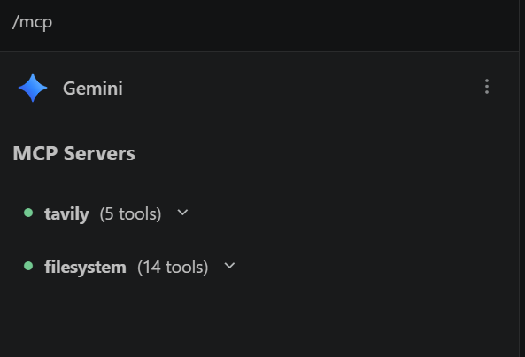

# My First Gemini MCP Agent (Windows 11) - Travel Advisor Agent

- This project documents the successful setup of a Model Context Protocol (MCP) environment using Gemini Pro and VSCode on a Windows 11 laptop.
- This setup allows Gemini to perform live web searches via Tavily and interact with local files.
- I have used Tavily due to its 1000 API call credits per month.

## 🛠️ Prerequisites
- **OS:** Windows 10/11
- **IDE:** VSCode with Python and Gemini Code Assist Extensions installed.
- **Runtime:** Node.js (LTS version)
- **Subscription:** Gemini Pro or any AI Platform of your choice.

## 📁 Required Folder Structure
1. Create a folder for your `settings.json` file: `%USERPROFILE%\.gemini\`
2. Create a folder for your agent's work: `C:\Users\<YourUsername>\Documents\AI_Projects`
3. Press `Ctrl+Shift+P` to open the `mcp.json` file, which gets created in folder path: `C:\Users\<YourUsername>\AppData\Roaming\Code\User`. Add contents from the `mcp.json` file uploaded here and replace the values.

## ⚙️ Configuration (The "Magic" settings.json)
- The configuration file must be named `settings.json` and located in the `C:\Users\<YourUsername>\.gemini` folder.
- This is the file used by the Gemini Code Assist Extension to utilize the Tavily MCP server and Filesystem settings. 

> **CRITICAL STEP:** For Gemini to successfully "see" the tools and turn the status dots green, keep the `settings.json` file **open in a VSCode tab**. This ensures the file is included in the "Context Items," allowing Gemini to initialize the Tavily and Filesystem tools properly.

## 🚀 Installed Tools
- **Tavily (Remote):** Provides high-quality, agent-optimized web search. [link to Tavily](https://www.tavily.com/)
- **Filesystem (Local):** Allows the agent to read and write files in the `AI_Projects` directory.

## 🧪 How to Test
1. Open Gemini Chat in VSCode.
2. Type `/mcp` to verify the connection. It should show the following markers in green to ensure the features are enabled:

3. Use an agentic prompt: *"Search for [Topic] using Tavily and save the results to a new file in my project folder."*
4. I have also uploaded some custom prompts in `prompt.txt` file.